# AZURE VM CREATION
1. Login to azure account
2. Click on search
   
   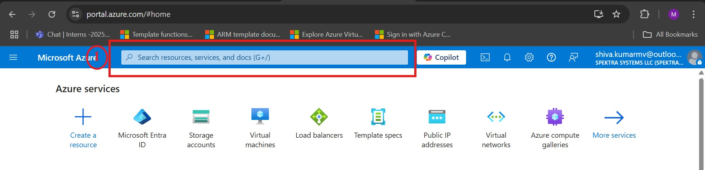

3. Enter virtual machines in the search and Under Services, select Virtual machines.

   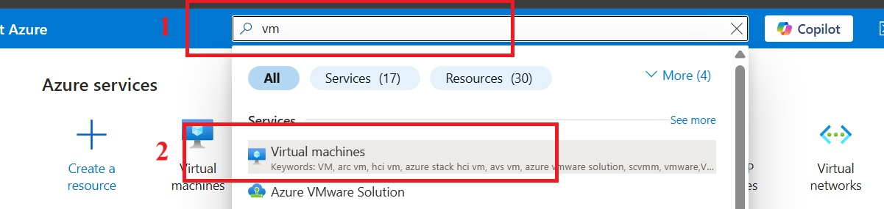

4. In the Virtual machines page, select Create and then Azure virtual machine. The Create a virtual machine page opens.

   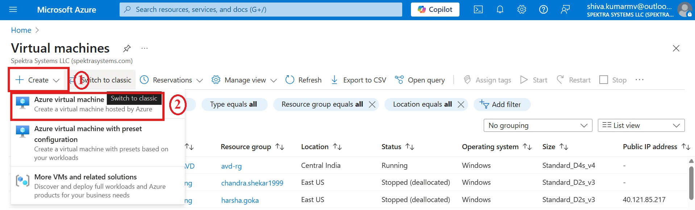

5. Under **project details**, select subscription `Innova8 Training` and respective resource group name `shiva.kumarmv`

   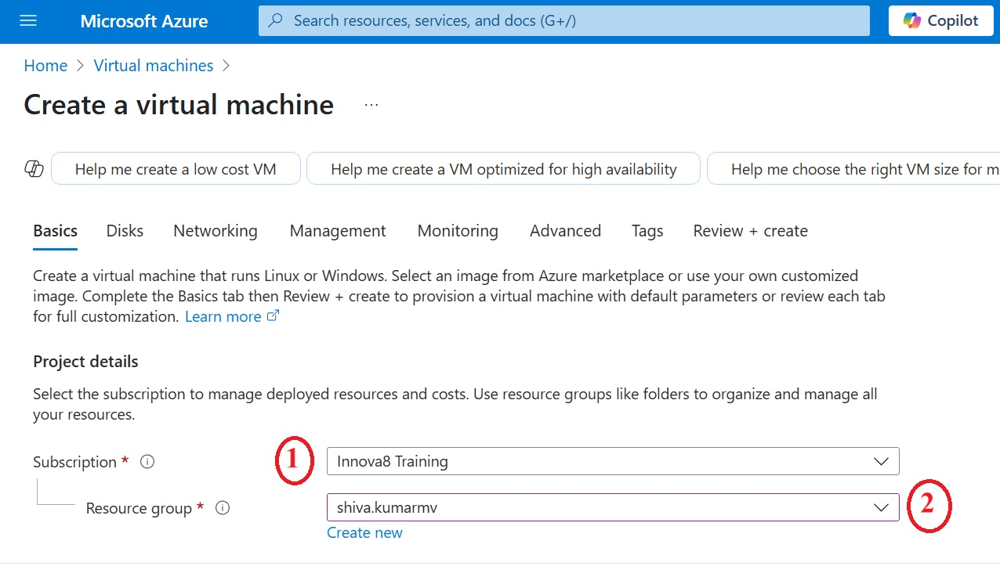

6. Under **Instance details**, enter `windowsvm` for the Virtual machine name and choose region `east us` and in availability option select availability zone  and select `zone 1`

   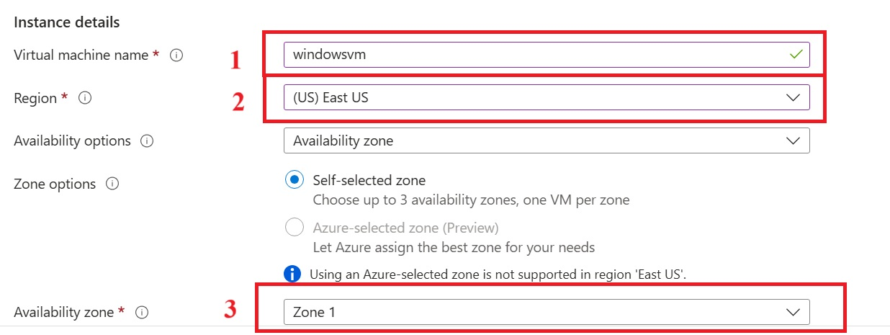

7. Choose `Windows Server 2022 Datacenter: Azure Edition - x64 Gen 2` for the Image and select `Standard_DS1_v2` for size. Leave the other defaults.

   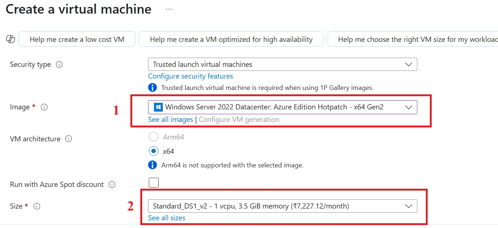

8. Under **Administrator account**, provide a username, such as `azureuser` and a password. The password must be at least 12 characters long `Azure portal - between 12 - 123` characters.

   8.1 Under **Inbound port rules**, choose Allow selected ports and then select `RDP (3389)` and `HTTP (80)` from the drop-down.

   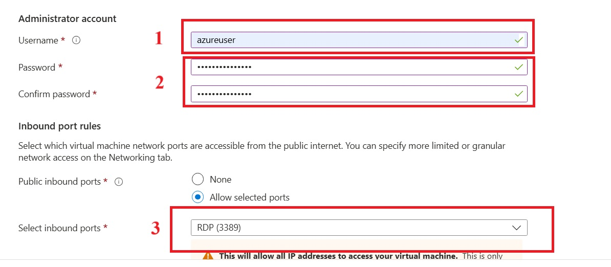

9. Leave the remaining defaults and then select the `next - Disk` button at the bottom of the page.

    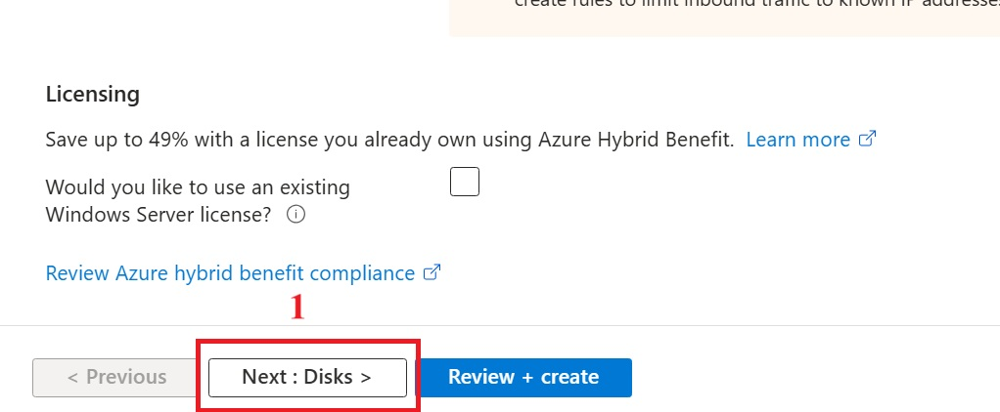
   
11. Under **os disk** , select the os disk size `image default 127GB` and os disk type `Standard SSD` and select delete with vm

    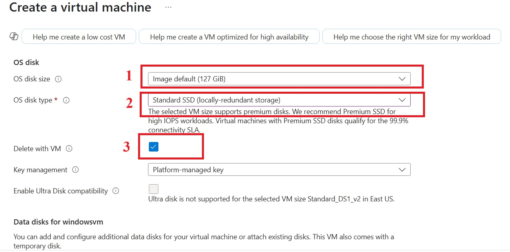

13. Leave the remaining defaults and then select the `next - Networking` button at the bottom of the page.

    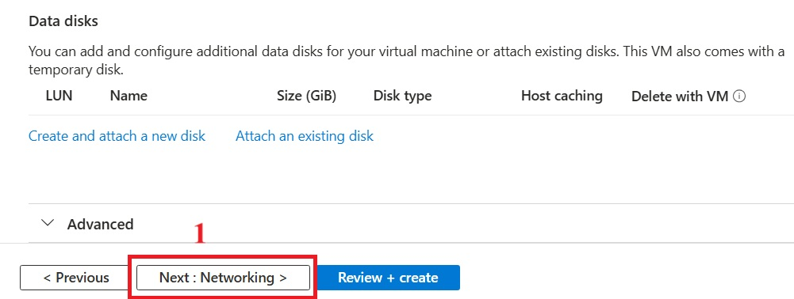

14. under **Network Interface** , Choose an existing virtual network and subnet or create new ones. in this case virtual network name  `windowsvm-vnet` and subnet `10.3.0.0/24` and public ip as `windowsvm-ip`

    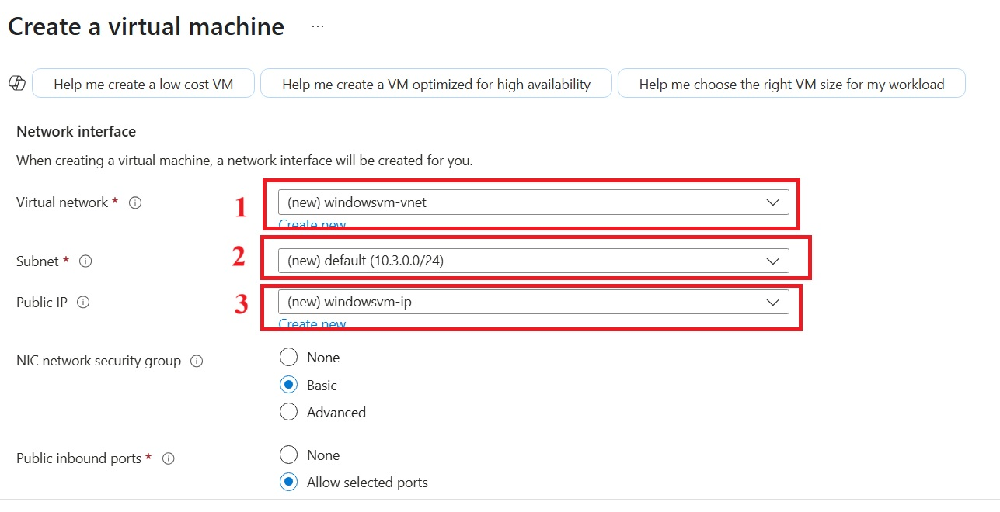

15. Select the delete public ip and nic when vm is deleted and leave the remaining defaults

    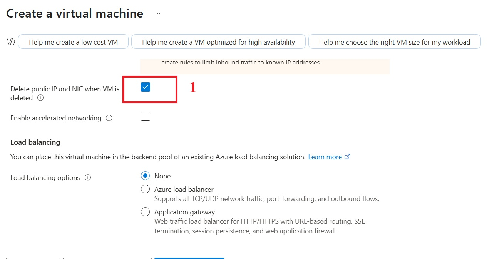

16. Leave the remaining defaults and then select the `Review + create` button at the bottom of the page.

    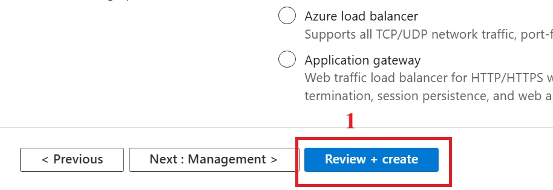

17. After validation runs, select the `Create` button at the bottom of the page

    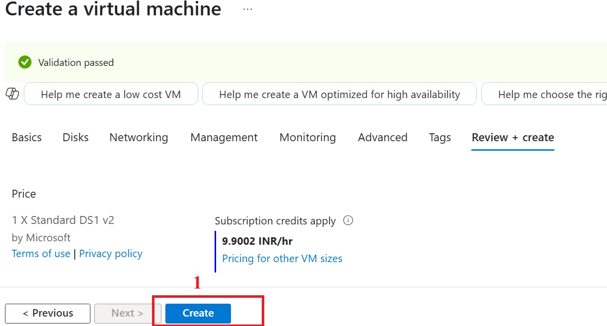

18. deploying resources

    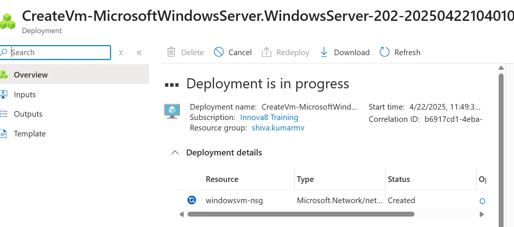

19. After deployment is complete, select `Go to resource`.

    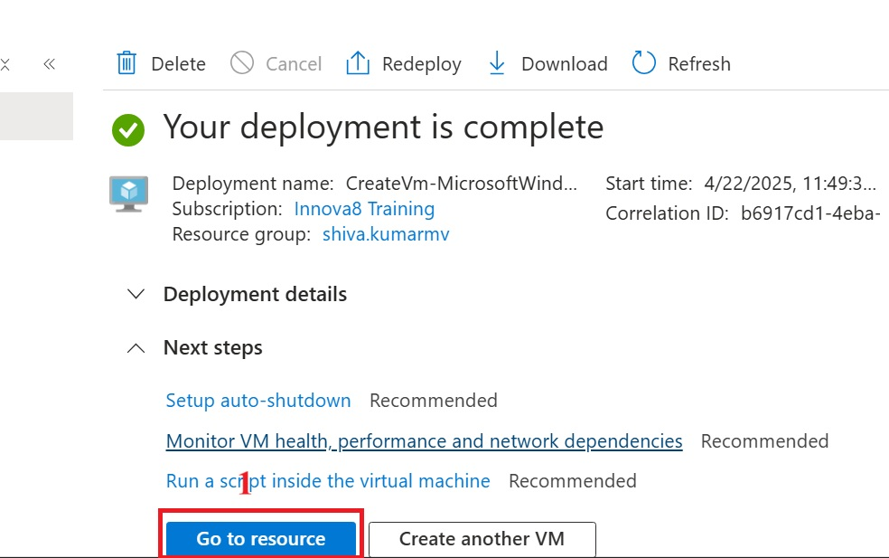

20. On the overview page for your virtual machine, click on connect and  select the `Connect`

    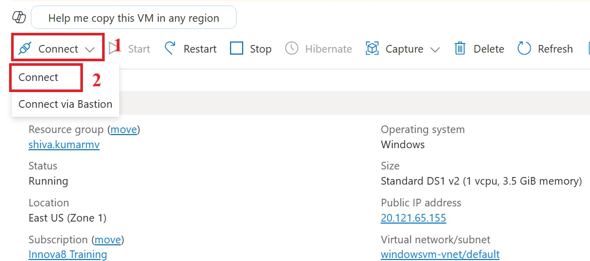

21. Scroll down and click `Download RDP file`.

    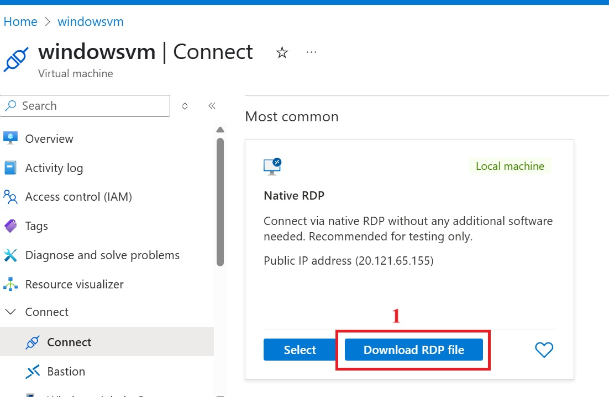

22. GO to downloads and Open the `downloaded RDP file` and click `Connect` when prompted

    

23.  Type the username `azureuser`, enter the password you created for the virtual machine, and then click OK.

     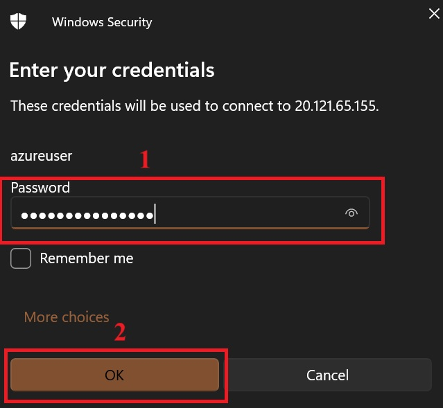

24. You may receive a certificate warning during the sign-in process. Click Yes or Continue to create the connection.

    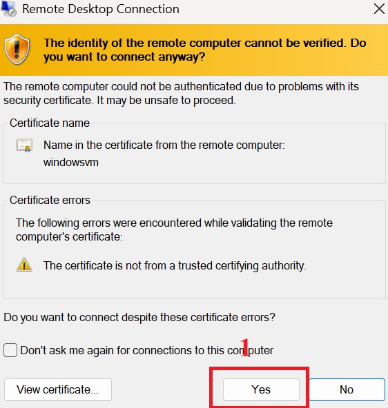
    

