# AZURE VM CREATION
1. Login to azure account
2. Click on **search**
   
   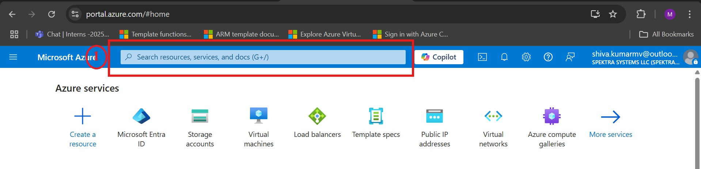

3. Enter **virtual machines** in the search and Under Services, select **Virtual machine**.

   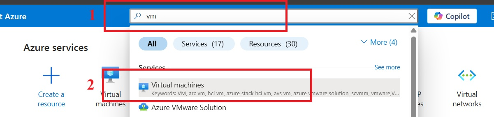

4. In the Virtual machines page, select **Create** and then **Azure virtual machine. The Create a virtual machine page opens.

   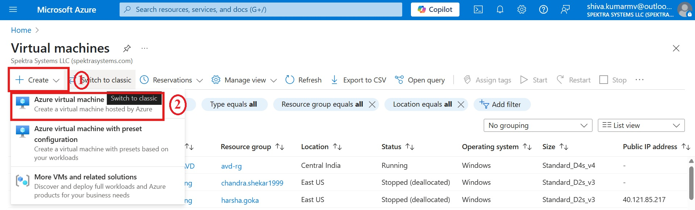

5. Under **project details**, select subscription `Innova8 Training` and respective resource group name `shiva.kumarmv`

   |Label|Name|
   |---|---|
   |Subscription|Innova8 Training|
   |Resource group| shiva.kumarmv|

   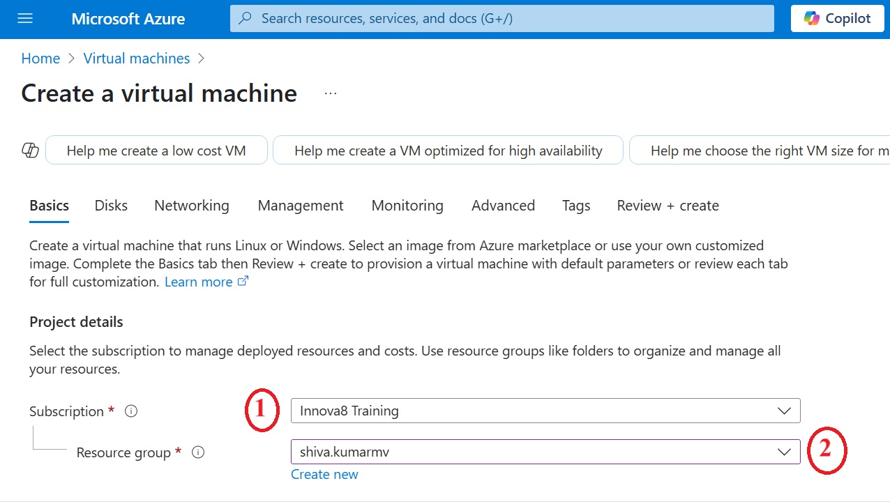

6. Under **Instance details**, enter `windowsvm` for the Virtual machine name and choose region `east us` and in availability option select availability zone  and select `zone 1`
   
   |Label|Name|
   |---|---|
   |Virtual machine name|windowsvm|
   |Region|east us|
   |availability option|availability zone |
   |availability zone| zone 1|

   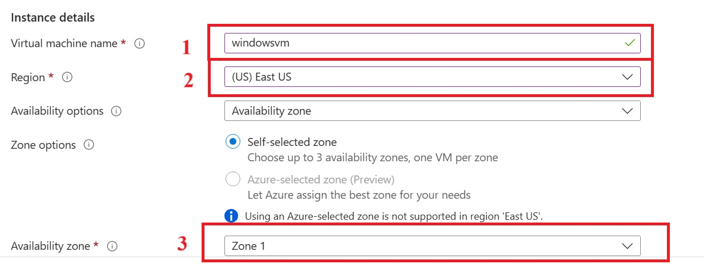

7. Choose `Windows Server 2022 Datacenter: Azure Edition - x64 Gen 2` for the Image and select `Standard_DS1_v2` for size. Leave the other defaults.

   |Label|Name|
   |---|---|
   |Image|Windows Server 2022 Datacenter: Azure Edition - x64 Gen 2|
   |Size|Standard_DS1_v2|

   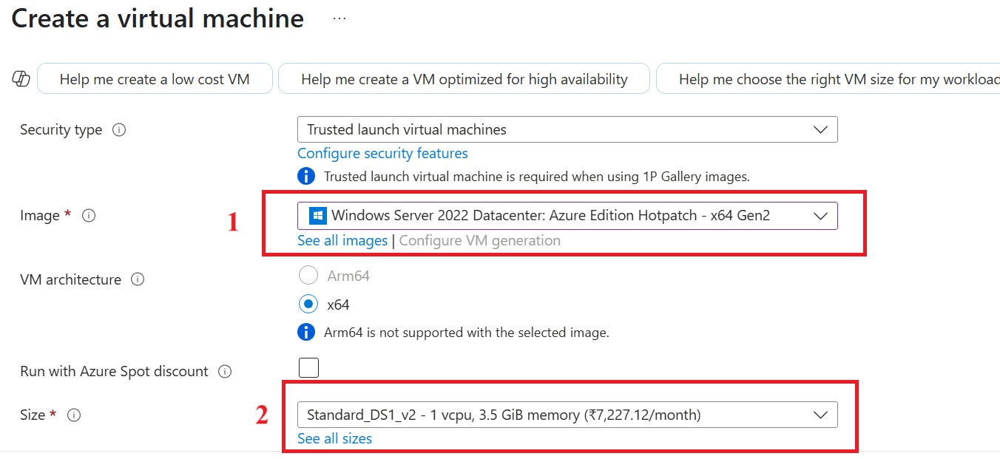

8. Under **Administrator account**, provide a **username**, such as `azureuser` and a **password** as `madhanshiva@12`. The password must be at least 12 characters long `Azure portal - between 12 - 123` characters.

   8.1 Under **Inbound port rules**, choose **Allow selected ports** and then select `RDP (3389)` from the drop-down.

   |Label|Name|
   |---|---|
   |username|azureuser|
   |password|madhanshiva@12|
   |Confirm Password| madhanshiva@12|
   |Indound rule|RDP (3389)|

   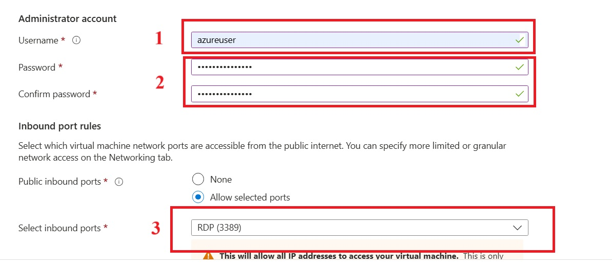

9. Leave the remaining defaults and then select the `next - Disk` button at the bottom of the page.

   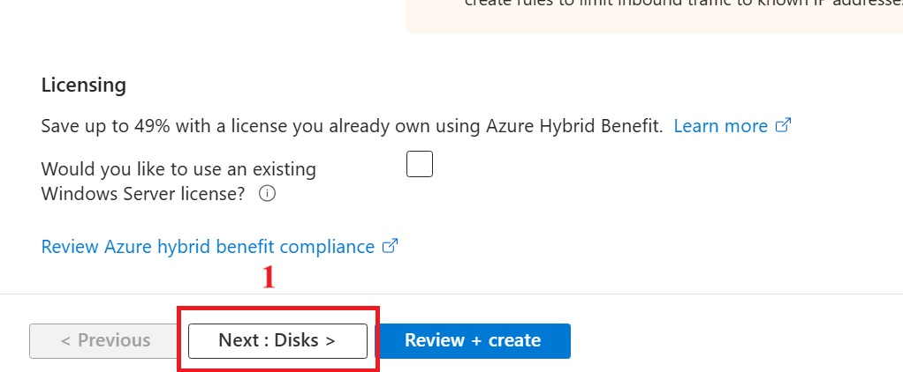
   
10. Under **os disk** , select the **os disk size** `image default 127GB` and **os disk type** `Standard SSD` and select **delete with vm**

    |Label|Name|
    |---|---|
    |os disk size|mage default 127GB|
    |os disk type|Standard SSD|
    |delete with vm| :white_check_mark:|__--
   
    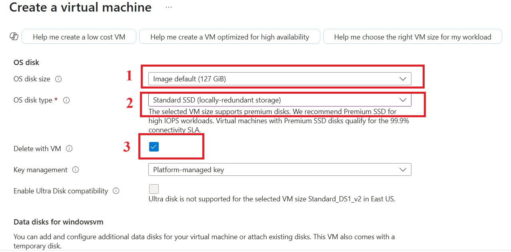

11. Leave the remaining defaults and then select the `next - Networking` button at the bottom of the page.

    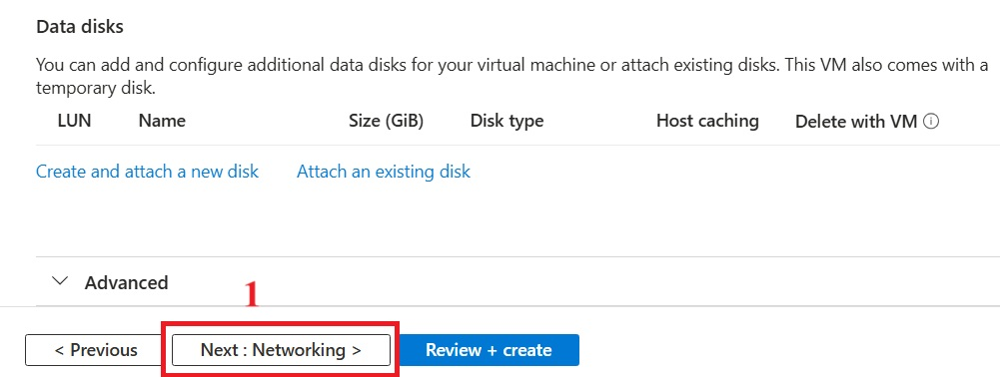

12. under **Network Interface** , Choose an existing virtual network and subnet or create new ones. in this case **virtual network** name  `windowsvm-vnet` and **subnet** `10.3.0.0/24` and **public ip** as `windowsvm-ip`

    |Label|Name|
    |---|---|
    |virtual network|windowsvm-vnet|
    |subnet|10.3.0.0/24|
    |public ip|windowsvm-ip|
    
    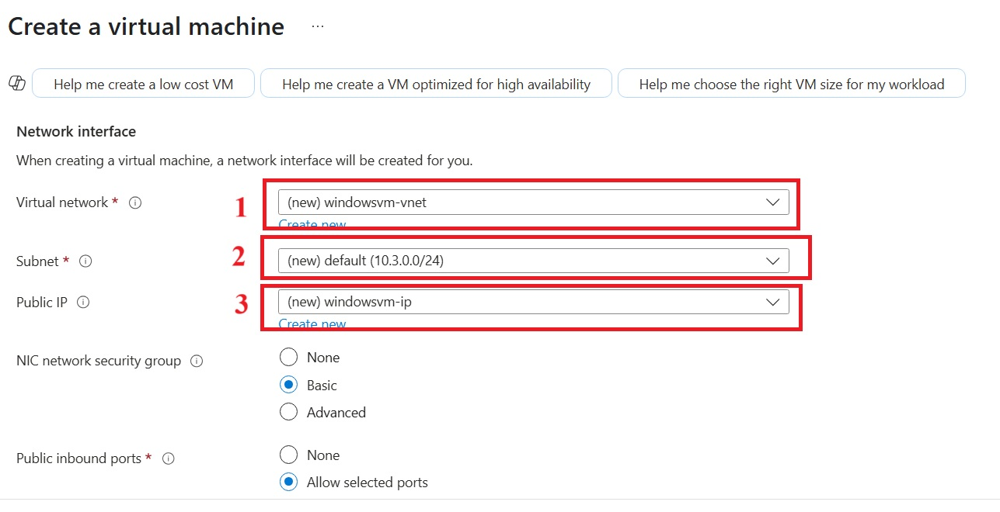

13. Select the **delete public ip and nic when vm is deleted**  and leave the remaining defaults

    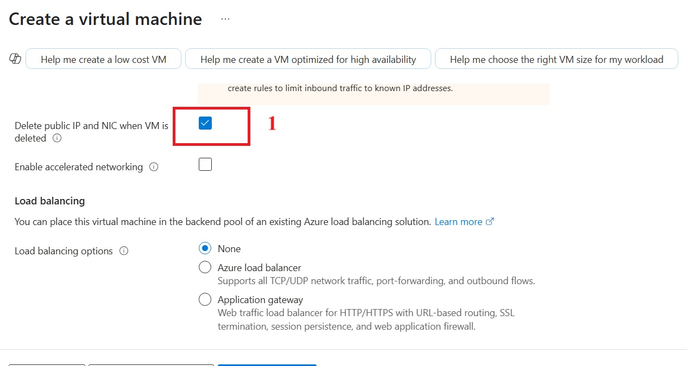

18. Leave the remaining defaults and then select the `Review + create` button at the bottom of the page.

    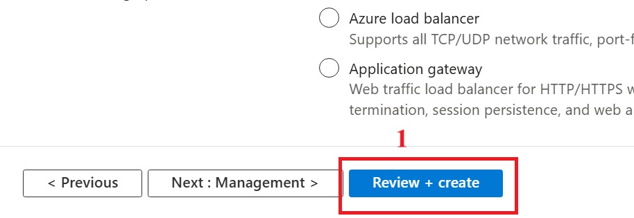

19. After validation runs, select the `Create` button at the bottom of the page

    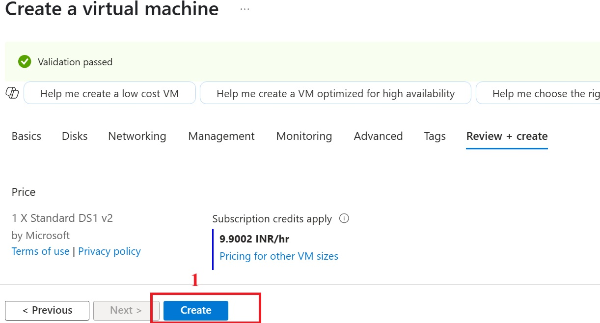

20. deploying resources

    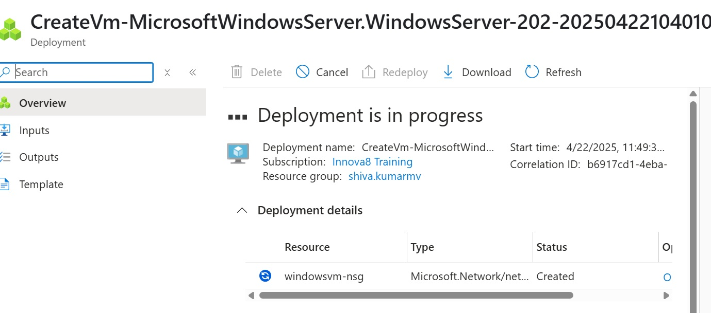

21. After deployment is complete, select `Go to resource`.

    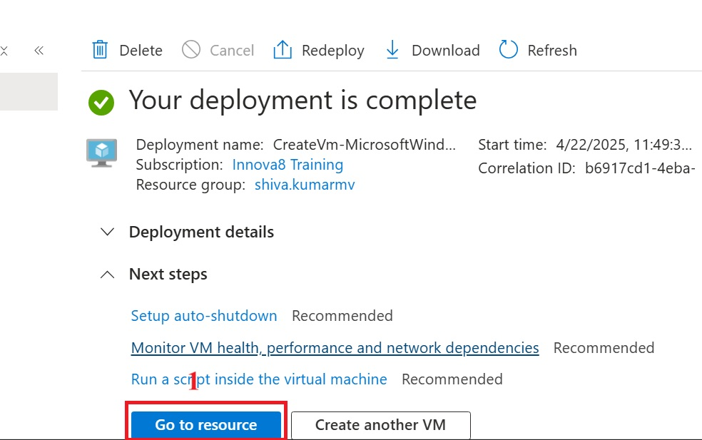

22. On the overview page for your virtual machine, click on connect and  select the `Connect`

    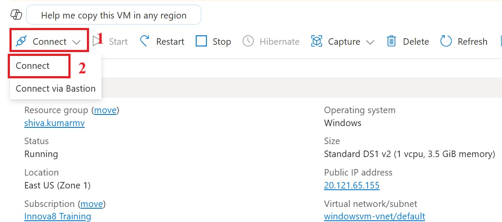

23. Scroll down and click `Download RDP file`.

    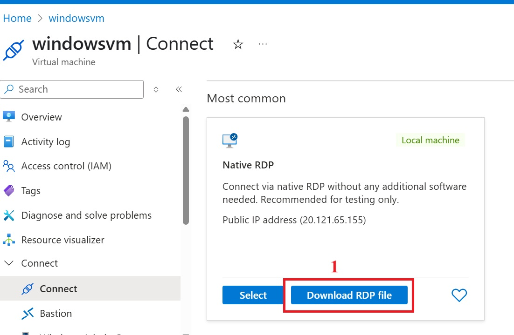

24. GO to downloads and Open the `downloaded RDP file` and click `Connect` when prompted

    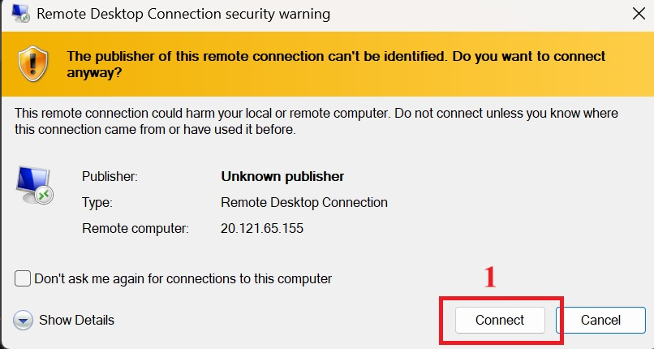

25.  Type the username `azureuser`, enter the password you created for the virtual machine, and then click OK.

     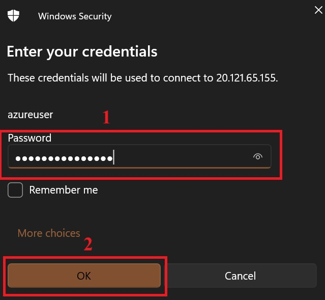

26. You may receive a certificate warning during the sign-in process. Click Yes or Continue to create the connection.

    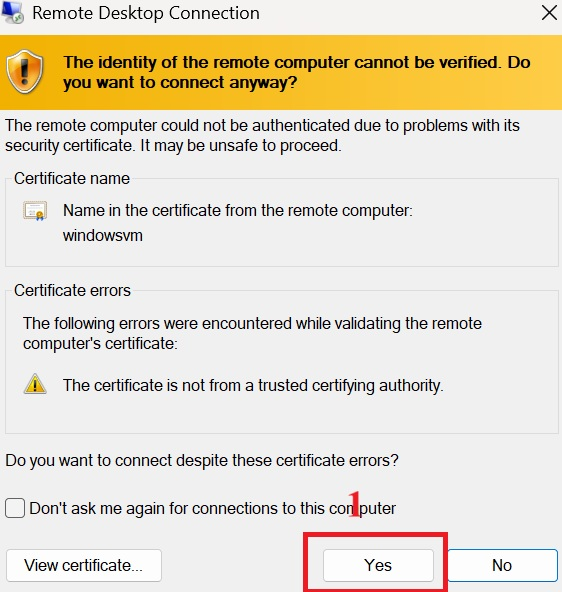
    

