# AZURE VM CREATION

# OVERVIEW 
   
In this process, we'll create a virtual machine (VM) in Microsoft Azure, which provides scalable, on-demand computing       resources in the cloud. We'll configure the VM with desired specifications, such as operating system, size, and networking   options. Once deployed, we'll connect to the VM using Remote Desktop Protocol (RDP) for Windows or SSH for Linux,          enabling remote management and operation of the virtual environment.

# TASKS
   - ### Task 1 - Create a Virtual Machine
   - ### Task 2 - Connect Virtual Machine

## Task 1 

1. Login to azure account
2. Click on **search** **(1)**
   
   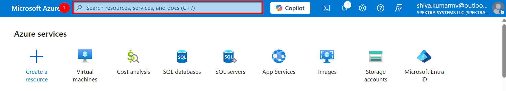

3. Enter **virtual machines** **(1)** in the search and Under Services, select **Virtual machine** **(2)**.

   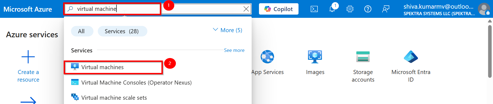

4. In the Virtual machines page, select **Create** **(1)** on top left  and then click on **Azure virtual machine** **(2)**. The Create a virtual machine page opens.

   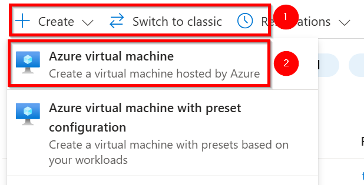

5. Under **project details**, select subscription **(1)** `Innova8 Training` and create or select respective resource group **(2)** name `shiva.kumarmv`

   |Label|Name|
   |---|---|
   |Subscription|Innova8 Training|
   |Resource group| shiva.kumarmv|

   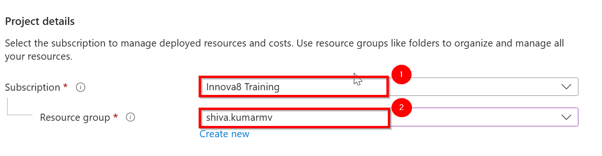

6. Under **Instance details**, enter `windowsvm` for the Virtual machine name **(3)** and choose region **(4)** `east us`, in **availability option** select **availability zone**  and select `zone 1` in  **availability zone** **(5)**
   
   |Label|Name|
   |---|---|
   |Virtual machine name|windowsvm|
   |Region|east us|
   |availability option|availability zone |
   |availability zone| zone 1|

   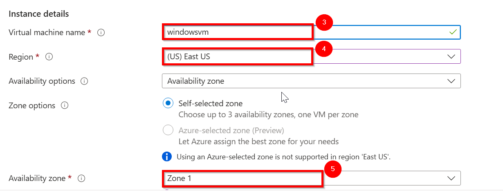

7. Choose `Windows Server 2022 Datacenter: Azure Edition - x64 Gen 2` for the **Image** **(6)**and select `Standard_DS1_v2` for **size** **(7)**. Leave the other defaults.

   |Label|Name|
   |---|---|
   |Image|Windows Server 2022 Datacenter: Azure Edition - x64 Gen 2|
   |Size|Standard_DS1_v2|

   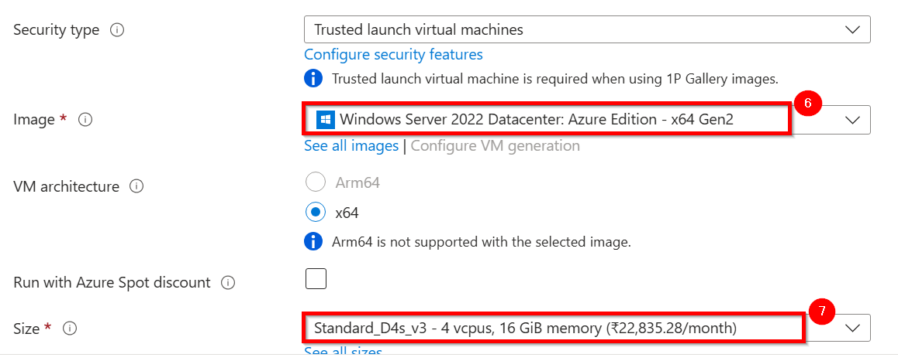

8. Under **Administrator account**, provide a **username** **(8)** such as `azureuser` and a **password** **(9)** as `madhanshiva@12`, same for **confirm password** **(10)** , The password must be at least 12 characters long `Azure portal - between 12 - 123` characters.

   8.1 Under **Inbound port rules**, choose **Allow selected ports** and then select `RDP (3389)` from the drop-down of **select inbound ports** **(11)**.

   |Label|Name|
   |---|---|
   |username|azureuser|
   |password|madhanshiva@12|
   |Confirm Password| madhanshiva@12|
   |Indound rule|RDP (3389)|

   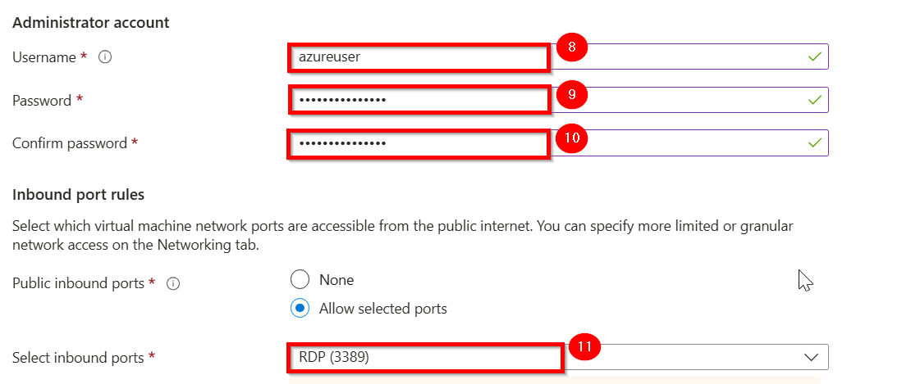

9. Leave the remaining defaults and then select the `next - Disk` **(12)** button at the bottom of the page.

   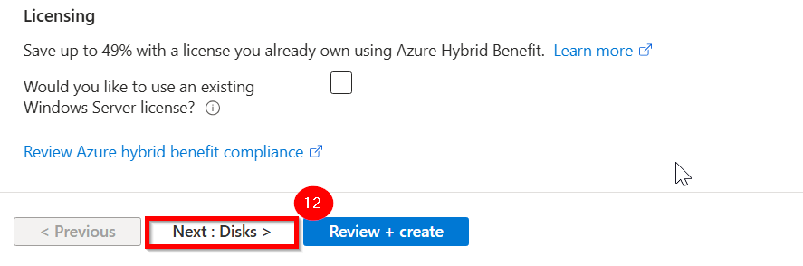
   
10. Under **os disk** , select the **os disk size** **(1)** `image default 127GB` and **os disk type** **(2)** `Standard SSD` and select **delete with vm** **(3)**

    |Label|Name|
    |---|---|
    |os disk size|mage default 127GB|
    |os disk type|Standard SSD|
    |delete with vm| :white_check_mark:|__--
   
    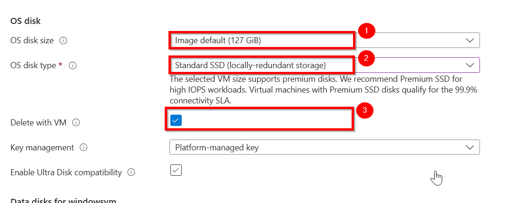

11. Leave the remaining defaults and then select the `next - Networking` **(4)** button at the bottom of the page.

    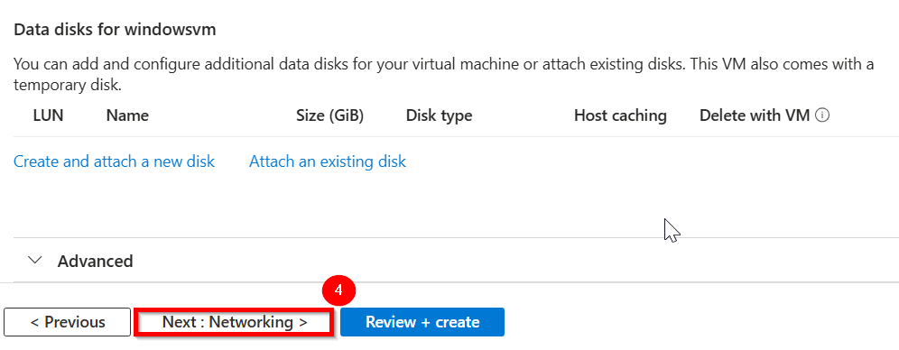

12. under **Network Interface** , Choose an existing virtual network and subnet or create new ones. in this case **virtual network** **(1)** name  `windowsvm-vnet` and **subnet** **(2)** `10.3.0.0/24` and **public ip** **(3)** as `windowsvm-ip`

    |Label|Name|
    |---|---|
    |virtual network|windowsvm-vnet|
    |subnet|10.3.0.0/24|
    |public ip|windowsvm-ip|
    
    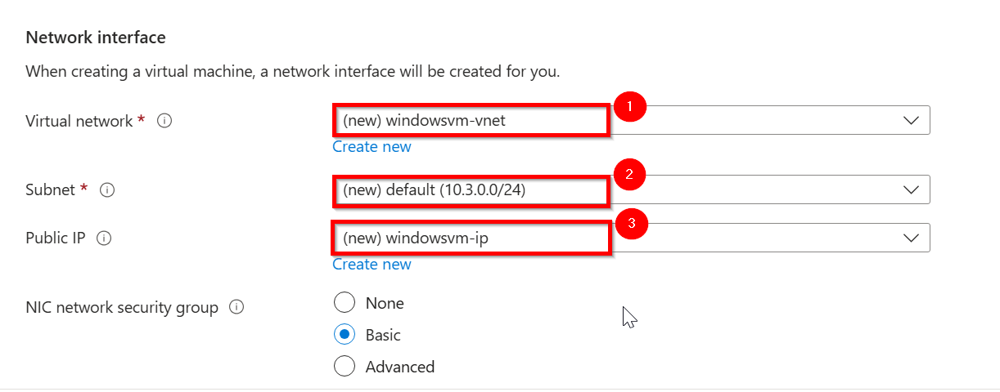

13. Select the **delete public ip and nic when vm is deleted** **(4)** and leave the remaining defaults

    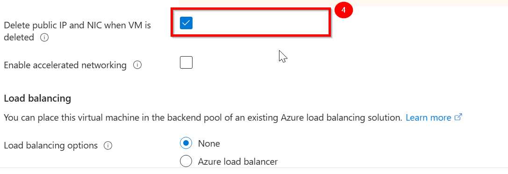

14. Leave the remaining defaults and then select the `Review + create` **(5)** button at the bottom of the page.

    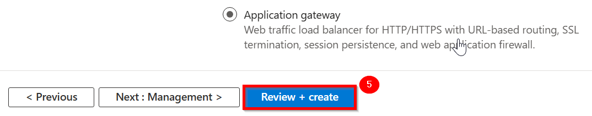

15. After validation runs, select the `Create` **(1)** button at the bottom of the page

    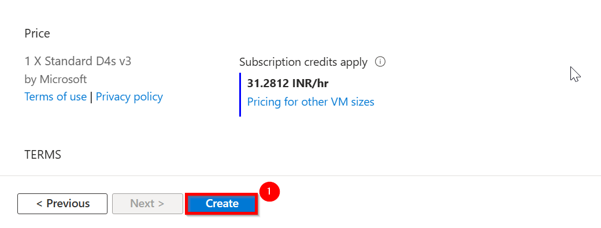

## Task 2

1. After deployment is complete, select `Go to resource` **(1)**.

    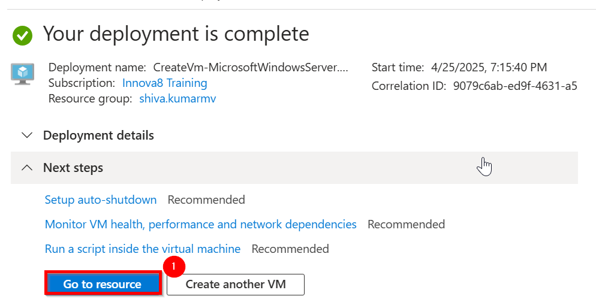

2. On the overview page for your virtual machine, click on connect **(1)** and  select the `Connect` **(2)**
    

    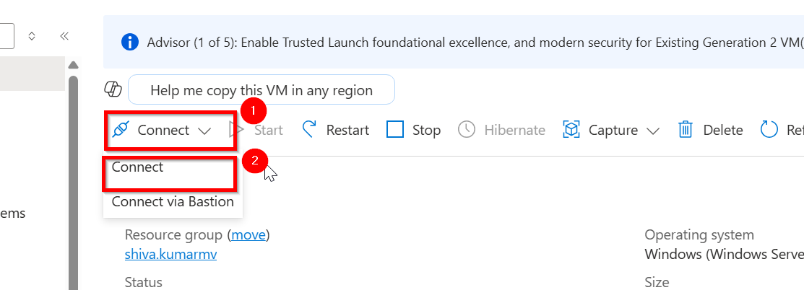

3. Scroll down and click `Download RDP file` **(1)**.

    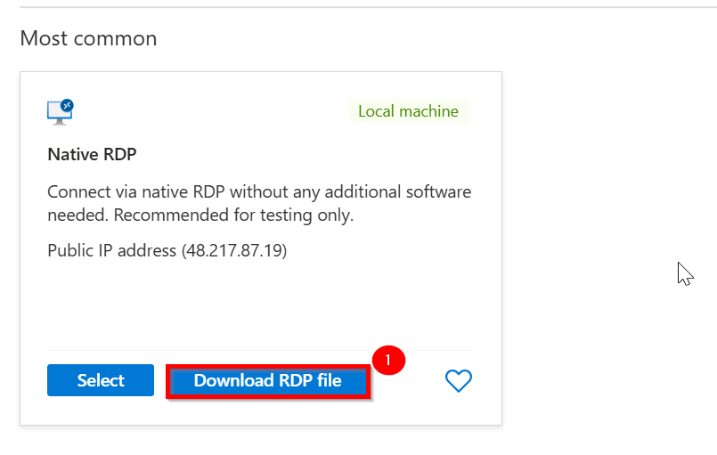

3. GO to downloads and Open the `downloaded RDP file` and click `Connect` **(1)** when prompted

    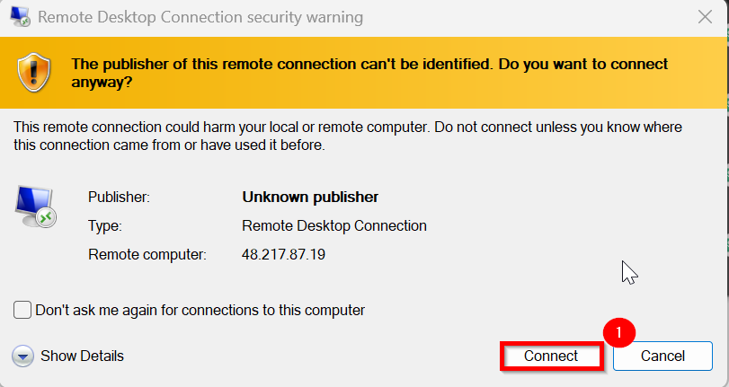

4.  Type the username `azureuser`, enter the password you created for the virtual machine in **password block** **(1)** , and then click **OK** **(2)**.

     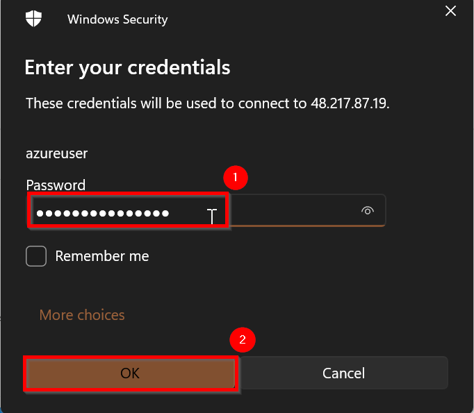

5. You may receive a certificate warning during the sign-in process. Click **Yes** **(1)** or Continue to create the connection.

    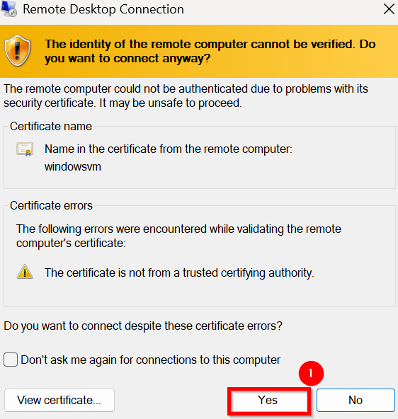
    

